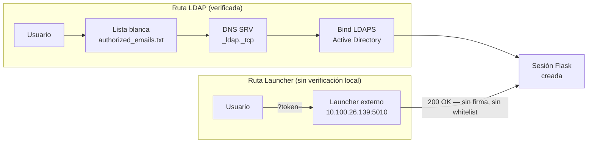
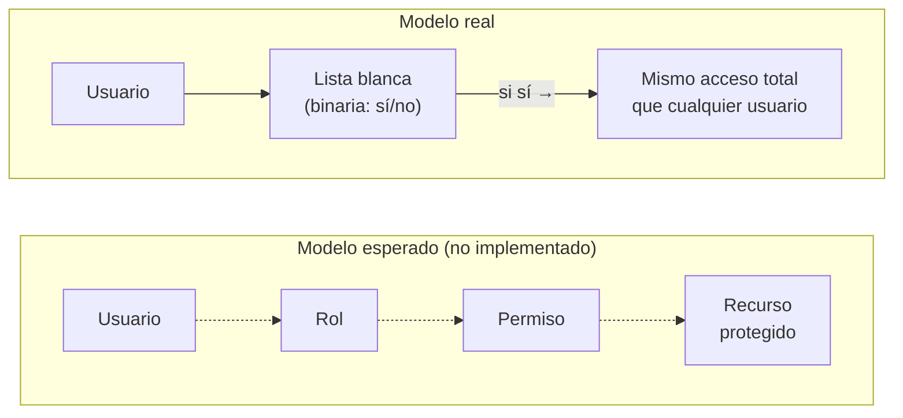

# Modelo de seguridad actual: autenticación, roles, permisos y datos

**Auditoría estática de código · ProdIA 2.0 — ECP Insights · 2026-08-24**

Estado verificado contra el código fuente del repositorio, sin pruebas de penetración ni acceso al servidor de producción. Cada afirmación cita el archivo y la línea donde se comprobó.

| | |
|---|---|
| **Alcance** | Flask (raíz) + INGESTA (FastAPI) |
| **Método** | Lectura íntegra de código + grep dirigido |
| **Entornos no verificados** | Servidor de pruebas / producción |

---

## Resumen ejecutivo

| Área | Estado |
|---|---|
| **Autenticación** | **LDAP contra Active Directory**, sin ningún rastro de Microsoft Entra ID. |
| **Roles** | No implementados. El único "rol" visible en la interfaz es **cosmético**. |
| **Permisos** | **Binarios**: lista blanca de correos + sesión sí/no. Sin gradación alguna. |
| **Datos de seguridad** | **Ninguna base de datos** del proyecto tiene tablas de usuarios, roles o permisos. |

### Hallazgos que requieren atención

- 🔴 **Crítico** — Los blueprints `routes/api.py` y `routes/chat.py` (~30+ endpoints, incluida ejecución de SQL) no tienen ningún control de sesión.
- 🟠 **Alto** — El inicio de sesión vía SSO ("launcher") confía en la respuesta HTTP de un servicio externo sin verificar la firma del token.
- 🟠 **Alto** — Los endpoints que exponen y recargan la lista de correos autorizados no requieren sesión.
- 🟡 **Medio** — No existe ningún modelo de roles o permisos granulares — todo usuario autenticado tiene el mismo acceso.

---

## 01 · Mecanismo actual de autenticación

> ¿Siguen autenticando contra Active Directory vía LDAP, o ya están usando Microsoft Entra ID?

### Veredicto

Es **100 % LDAP contra Active Directory** hoy. No hay Microsoft Entra ID, Azure AD, MSAL, OAuth2, OIDC ni SAML en ningún punto del código — ni en producción ni en desarrollo.

La verificación fue negativa y exhaustiva: se buscaron los patrones `Entra`, `Azure`, `MSAL`, `OAuth2`, `OIDC`, `SAML` y `azure-identity` en todo el repositorio. Las nueve coincidencias que aparecieron no son de identidad: "Azure Synapse" es la base de datos legacy de SQL Server (`.env.example:12`), y "Azure Information Protection" se refiere al cifrado de documentos Office, no a autenticación de usuarios (`INGESTA/Rep_Prod/OCR_REPORTES_CIFRADOS.md:28`).

### El flujo LDAP, paso a paso

Todo el mecanismo vive en una única clase, `AuthService` (`utils/auth_service.py`):

- **Dominio fijo:** `red.ecopetrol.com.co`, hardcodeado — `utils/auth_service.py:22`.
- **Resolución del servidor:** consulta DNS SRV sobre `_ldap._tcp.red.ecopetrol.com.co` y arma la URL como `ldaps://` — siempre cifrado con TLS, nunca LDAP en claro — `utils/auth_service.py:40-71`.
- **Filtro previo:** antes de intentar el bind, el correo se compara contra una lista blanca local; si no está, se corta ahí sin tocar LDAP — `utils/auth_service.py:176-193`.
- **Bind simple:** `Connection(server, user=username, password=password).bind()` — éxito autentica, fallo devuelve "usuario o contraseña incorrectos" — `utils/auth_service.py:222-267`.
- **Sin lectura de directorio:** en todo el archivo no hay ninguna llamada a `conn.search()`. El bind valida la contraseña y nada más — nunca se leen grupos (`memberOf`) ni atributos (`displayName`, `givenName`). El nombre que ve el usuario se deriva del correo por texto, no del directorio (ver sección 02).
- **Si LDAP no responde:** no hay degradación ni reintento con otra fuente — nadie puede iniciar sesión, salvo por los dos mecanismos de desarrollo descritos abajo — `utils/auth_service.py:196-236`.

### Una segunda vía de entrada: el "launcher" SSO

`POST /auth/token-login` (`routes/auth.py:61-160`) es un flujo SSO propio de Ecopetrol contra un servicio "lanzador" interno — **no es Entra ID**. La app recibe un token en la URL, lo reenvía a `LAUNCHER_VERIFY_URL` (por defecto una IP interna, `.env.example:43`) y, si ese servicio responde 200, crea la sesión.

El propio comentario del código lo dice sin rodeos: esta ruta *"no consulta la whitelist local: confía en que el launcher ya autorizó"* (`routes/auth.py:68`). Tampoco se valida la firma del token en el lado de Flask — no hay ninguna librería de verificación JWT importada en el archivo. Es una segunda superficie de confianza, estructuralmente distinta al bind LDAP.

*Ambas rutas terminan en la misma sesión. La ruta LDAP pasa por tres verificaciones (lista blanca, resolución DNS, bind contra el directorio); la ruta del launcher solo espera un 200 OK del servicio externo, sin validar firma ni consultar la lista blanca — `routes/auth.py:68-114`.*

### Bypasses de desarrollo

Dos interruptores por variable de entorno, ambos **desactivados** en el `.env` actual del repositorio (`.env:58-61`):

| Variable | Efecto | Sigue validando lista blanca |
|---|---|---|
| `DEVELOPMENT_MODE` | Salta la resolución DNS y el bind LDAP; cualquier contraseña es aceptada | Sí |
| `LOGIN_BYPASS_EMAILS` | Entra sin LDAP y sin lista blanca, con cualquier contraseña, para los correos listados | No |

Fuente: `routes/auth.py:16-49, 199-240, 278-287`.

---

## 02 · Modelo actual de roles

> Listado de los roles que existen actualmente.

### Veredicto

No hay ningún modelo de roles funcional. La sesión no lleva campo de rol; el único "rol" visible en pantalla es un elemento cosmético que se muestra igual a todos los usuarios.

Los tres puntos donde el backend construye la sesión de usuario (SSO, bypass de desarrollo y LDAP normal) usan exactamente el mismo conjunto de campos: `username, domain, email, authenticated, first_name, last_name, full_name` — ninguno de los tres incluye `role` ni `is_admin` (`routes/auth.py:129-137, 210-218, 306-314`).

### Todo lo que el código menciona con la palabra "rol" o "admin"

| Mención | Estado | Evidencia |
|---|---|---|
| Insignia "ADMIN" en el menú de usuario | Cosmético — texto fijo, sin condición, se pinta a todo usuario | `mainchat_layout.html:53` |
| Rutas `/admin`, `/test-clas`, `/settings` | Botones de interfaz sin ruta de backend detrás | `mainchat_layout.html:62-74` |
| Campo `is_admin` | No existe en el código; solo aparece en un documento de planeación como algo pendiente de decidir | `Planes/plan_usuario_pie_historial.md:631` |
| Roles "Admin / Limitado" por campo asignado | Ajeno a este repositorio — descripción tomada de la memoria de otro proyecto guardada como referencia | documentacion de referencia interna, linea 156 |
| Grupos de Active Directory (`memberOf`) | Nunca se consultan — el bind LDAP no hace ninguna búsqueda al directorio | `utils/auth_service.py` (ausencia verificada) |

Consecuencia práctica: **todo usuario que pasa la autenticación tiene exactamente los mismos privilegios de aplicación**. No existe ningún decorador tipo `@requires_role` o `@admin_required` en ningún archivo del backend.

---

## 03 · Modelo actual de permisos

> Listado de permisos existentes.

### Veredicto

Dos controles binarios, sin ninguna gradación: pertenecer a una lista blanca de correos, y tener una sesión activa. No hay permisos por sección, página, campo de datos ni acción.

### Capa 1 — lista blanca de correos

`data/extra_files/authorized_emails.txt`: archivo de texto plano, un correo por línea, con 24 direcciones del dominio corporativo en el estado actual del repositorio. Se carga en memoria al iniciar y puede recargarse en caliente. Es binaria: el correo está en el archivo o no lo está — no hay niveles (`utils/auth_service.py:73-102, 25-27`).

### Capa 2 — sesión autenticada

`utils/auth_middleware.py:13-45` es el único decorador de autorización de todo el repositorio. Comprueba únicamente que exista `session["user"]["authenticated"]`. Binario: dentro o fuera, sin grados intermedios.

### Lo que la lista blanca y la sesión NO cubren

Dos blueprints completos no tienen ningún control de sesión — ni el decorador, ni una comprobación manual de `session`:

| Blueprint | Requiere sesión | Ejemplos de rutas expuestas |
|---|---|---|
| `main_bp` | Sí | `routes/main.py:13,51,78,86` |
| `colapsable_bp` | Sí | `routes/colapsable.py:28` |
| `mainchat_bp` | Sí | `routes/mainchat.py:29` |
| **`api_bp`** | **No** | `POST /api/sql/execute`, `POST /api/ingesta/upload`, `POST /api/ai/generate` — `routes/api.py:794,28,846` |
| **`chat_bp`** | **No** | `GET /chat/conversations`, `GET /chat/messages/<id>` — `routes/chat.py:10,22,37,49` |
| `auth_bp` (subconjunto) | No | `/auth/health`, `/auth/dns-status`, `/auth/authorized-emails`, `/auth/reload-authorized-emails` |

No existe ningún `before_request` global en `app.py` ni en ningún blueprint que aplique control de acceso de forma transversal (verificado, sin resultados). La única validación de sesión fuera de `@login_required` está en los manejadores de SocketIO (`app.py:118-158`), que no cubren las rutas REST de `api_bp` ni `chat_bp`.

---

## 04 · Modelo de datos de seguridad

> Tablas que manejan usuarios, roles y permisos. Relaciones Usuario → Rol → Permiso.

### Veredicto

**No existe ninguna tabla de usuarios, roles ni permisos en ninguna base de datos del proyecto.** La autorización se resuelve fuera de cualquier base de datos propia.

Se revisaron las cuatro bases de datos del sistema. Una búsqueda de `CREATE TABLE` con los patrones `user|usuario|role|rol|permiso|permission|session|sesion` sobre todos los `.sql` del repositorio no devolvió ninguna coincidencia:

| Base de datos | Contenido | Tablas de seguridad |
|---|---|---|
| SQLite `chat_history.db` | `conversations`, `messages` — historial de chat | Ninguna |
| SQLite `ECP_PROD.db` | Datos de producción de hidrocarburos | Ninguna |
| SQL Server / Azure Synapse (legacy) | Solo credenciales de conexión de servicio, sin usuarios de aplicación | Ninguna |
| PostgreSQL `daily_report_prod` | Modelo estrella de producción (esquemas bronze/core) | Ninguna |

La única tabla con un campo llamado `user_id` es `conversations` del chat (`utils/chat_history.py:34-43`), y ese campo es texto libre (el correo/username), no una clave foránea a una tabla de usuarios que no existe. La columna `role` de la tabla `messages` tampoco es un rol de autorización: es el rol del mensaje en la conversación (`user`/`assistant`), un concepto estándar de interfaces de chat, sin relación con permisos (`utils/chat_history.py:50`).

*El modelo esperado (arriba, líneas punteadas) encadenaría Usuario → Rol → Permiso → Recurso. Ninguno de esos tres vínculos existe hoy. El modelo real (abajo) tiene dos pasos: pertenecer a la lista blanca, y — si es así — recibir exactamente el mismo acceso que cualquier otro usuario autenticado.*

---

## Auditoría y registro de eventos

*Hallazgo adicional, relevante para una revisión de seguridad aunque no fue preguntado directamente.*

Existe una clase dedicada, `AuthLogger` (`utils/auth_logger.py`), que registra inicios de sesión exitosos, fallidos y cierres de sesión — incluyendo los que ocurren vía el bypass de desarrollo. La persistencia es **exclusivamente en archivo de texto**, con rotación diaria y 30 días de retención (`data/logs/auth_operations.log`) — no hay ninguna tabla de base de datos que almacene estos eventos.

- El método `log_session_expired` está definido pero **nunca se invoca** en ningún punto del código (`utils/auth_logger.py:96-103`).
- No hay auditoría centralizada de acciones posteriores al login (qué consultas ejecutó cada usuario, qué endpoints de `/api/*` llamó) — solo lo que cada endpoint decida registrar por su cuenta con el logger estándar de Python.
- El servicio de solicitud de acceso (`/auth/request-access`) escribe en un log de archivo, pero el envío de correo al administrador que la interfaz promete al usuario (`templates/login.html:143`) tiene un `TODO` pendiente sin implementar (`utils/access_request_service.py:40`).

---

## A · Registro de hallazgos

*Todos los hallazgos de esta auditoría, en un solo lugar, ordenados por severidad.*

| ID | Severidad | Hallazgo | Evidencia |
|---|---|---|---|
| H-01 | 🔴 Crítico | Blueprint `api_bp` (incl. `/api/sql/execute`) sin ningún control de sesión | `routes/api.py` |
| H-02 | 🔴 Crítico | Blueprint `chat_bp` sin ningún control de sesión | `routes/chat.py:10,22,37,49` |
| H-03 | 🟠 Alto | Login SSO confía en respuesta HTTP externa sin verificar firma del token ni consultar la lista blanca | `routes/auth.py:68,83-114` |
| H-04 | 🟠 Alto | Endpoints que exponen y recargan la lista de correos autorizados, sin sesión requerida | `routes/auth.py:660-733` |
| H-05 | 🟡 Medio | Sin modelo de roles/RBAC — insignia "ADMIN" cosmética para todo usuario | `mainchat_layout.html:53` |
| H-06 | 🟡 Medio | El bind LDAP no lee grupos ni atributos del directorio | `utils/auth_service.py` |
| H-07 | 🟡 Medio | Endpoints de diagnóstico LDAP/DNS sin protección de sesión | `routes/auth.py:464-586` |
| H-08 | 🔵 Informativo | Bypasses de desarrollo presentes en el código, pero desactivados en el `.env` actual | `routes/auth.py:16-49` |
| H-09 | 🔵 Informativo | Auditoría de login solo en archivo (30 días), sin cobertura de acciones post-login | `utils/auth_logger.py` |
| H-10 | 🔵 Informativo | Notificación por correo de solicitudes de acceso, prometida en la UI, no implementada | `access_request_service.py:40` |

---

## Alcance y método

Este documento se construyó mediante lectura íntegra del código fuente y búsquedas dirigidas (grep) sobre todo el repositorio, excluyendo entornos virtuales. No incluye pruebas de penetración, análisis dinámico ni acceso al servidor de pruebas o producción — algunos hallazgos (por ejemplo, si los bypasses de desarrollo están activos en el `.env` del servidor 139) requieren verificación adicional in situ. Todas las citas `archivo:línea` corresponden al estado del repositorio al 2026-08-24.

**Nota sobre la lista blanca:** este documento describe el mecanismo de `authorized_emails.txt` (24 correos del dominio corporativo en un archivo de texto) sin listar las direcciones reales, ya que no aportan al análisis arquitectónico.
